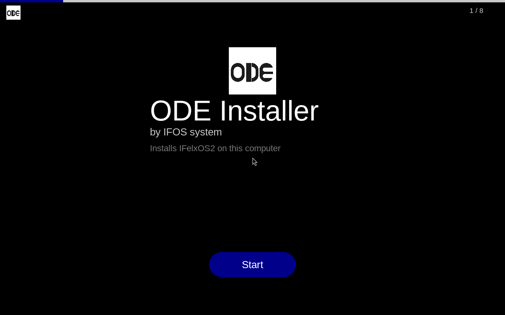
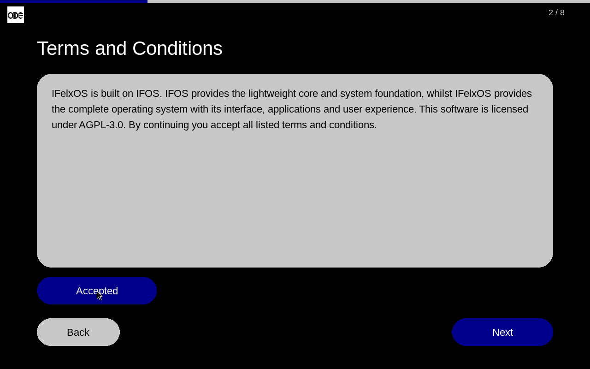
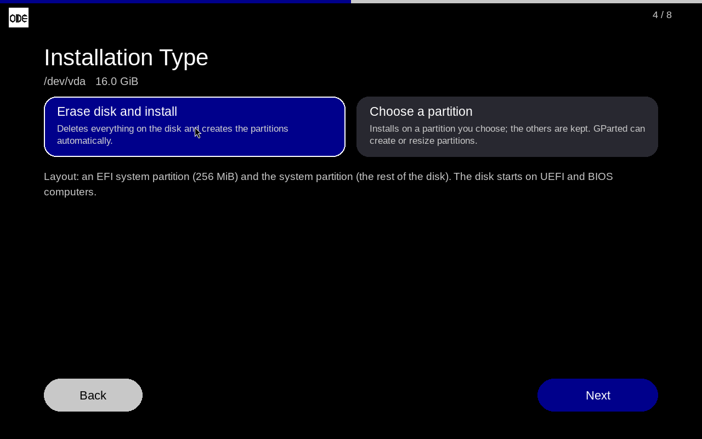
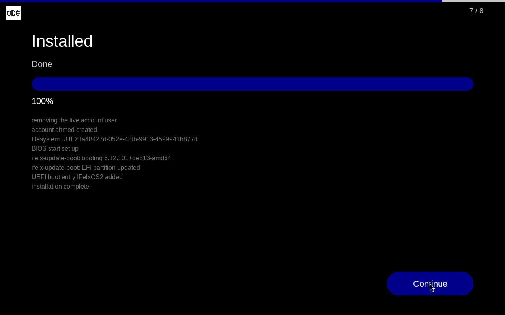
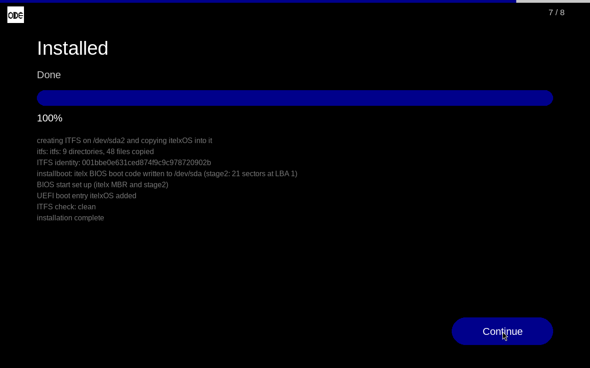

# ODE Installer

ODE is an installer medium for operating systems. It starts from a USB stick
or a CD on UEFI and BIOS computers, shows a full-screen installer window and
writes a system to a disk. It was made for IFelxOS2 and is used for itelxOS
1.2, and it can carry your own system: you take a finished ODE medium,
replace the system image and the texts, and you have an installer for your
system, without rebuilding ODE.



Licensed under the GNU Affero General Public License v3.0 (see `LICENSE`).

## What is on the medium

| | |
|---|---|
| `/boot/vmlinuz`, `/boot/initrd.img` | the installer system: a small Ubuntu 24.04 that runs entirely from its initrd (Xorg, openbox, GParted, Python + pygame, the window) |
| `/ifelxos/filesystem.squashfs` | **the system that gets installed**; read from the medium, never loaded into memory |
| `/app/config.json` (inside the initrd) | the system's name, minimum size and the texts of the pages |
| `/usr/sbin/ode-install` (inside the initrd) | the backend that checks a disk, partitions, copies and sets up booting |
| `/boot/efi.img`, GRUB | the medium starts through IFelxBoot on UEFI and through GRUB on BIOS |

The installer finds its medium however the stick was made: written as an
image (dd, Etcher, Rufus "DD mode") or a CD, files copied to a FAT32 / exFAT /
NTFS stick (Rufus "ISO mode"), or the ISO kept as a file (Ventoy). That stick
is never offered as a target.

## Using it

1. Write the ISO to a USB stick (Rufus, Etcher, Ventoy or `dd`) and start the
   computer from it.
2. **Start**, accept the terms, pick the disk.
3. Pick the installation type:
   * **Erase disk and install**: a new MBR table with a 256 MiB EFI partition
     and the system partition; the disk starts on UEFI and on BIOS.
   * **Choose a partition**: the system goes on one partition (formatted),
     the others are kept. GParted opens from this page to make room. An EFI
     partition already on the disk is used as it is, never formatted.
4. Computer name, account and password, then the final confirmation.
5. **Install**. When it says *Done*, remove the stick and restart.

| | | |
|---|---|---|
|  |  |  |

## Put your own system in ODE

You do not rebuild ODE for this. `tools/make-custom-ode.sh` takes a finished
ODE ISO and replaces only the system image, `config.json` and, when needed,
the backend. Everything else (kernel, installer system, window, boot loaders,
boot records) stays as it is.

```bash
# Linux or WSL, as root; needs xorriso zstd cpio squashfs-tools python3
sudo tools/make-custom-ode.sh \
    --iso ODE_installer.iso \
    --config my-config.json \
    --tree my-rootfs/            # or: --squashfs my.squashfs
    [--backend my-ode-install] \
    -o MyOS_installer.iso
```

### 1. config.json

```json
{
  "logo_path": null,
  "logos_dir": null,
  "system": {
    "name": "MyOS",
    "image": "/run/ode/medium/ifelxos/filesystem.squashfs",
    "default_hostname": "myos",
    "min_root_mib": 4096
  },
  "pages": {
    "welcome": { "title": "ODE Installer", "subtitle": "MyOS 1.0" },
    "terms":   { "body": "Your licence and terms here." },
    "finish":  { "title": "Installation Complete",
                 "message": "MyOS is installed. Remove the medium and restart." }
  }
}
```

Keep `image` as it is: the tool always puts your system at that path.

### 2. The system image

* **IFelxOS-family systems** (built on IFOS2 / IFelxOS2, with
  `/usr/local/sbin/ifelx-update-boot` and `/dex/IFelxUi/installer`): the stock
  backend installs them as they are. It formats ext4, removes the live
  account, creates the user's account with `useradd`, locks root, and sets up
  GRUB (BIOS) and IFelxBoot (UEFI).
* **Any other system** needs its own backend (`--backend`). Write it with
  the same command line and the same output the window reads:

```
ode-install check erase  <disk>
ode-install check manual <disk> <root-partition>      -> OK / WARN <msg> / FAIL <msg>
ode-install erase  <disk> <hostname> <account>
ode-install manual <disk> <root-partition> <hostname> <account>
    the password is the first line on standard input, never an argument
output while installing, one line each:
    STEP <name> <percent> | PROGRESS <percent> | WARN <msg> | ERROR <msg> | DONE
```

`examples/itelxOS/` is a complete example: itelxOS is not Linux (its own
kernel, ITFS filesystem and BIOS boot code), and its `ode-install` writes ITFS,
the EFI partition with IFelxBoot and the itelx kernel, and itelx's MBR. The
installer made with the command above from these files was started in a
virtual machine, installed itelxOS and started it.



## Building ODE from source

Only needed to change the installer itself (the window, the installer system,
the stock backend). Inside WSL (Ubuntu 24.04) or Ubuntu, as root:

```bash
mkdir -p input
cp /path/to/IFelxOS2.iso input/IFelxOS2.iso      # its live/filesystem.squashfs is installed
cp /path/to/earlier-ODE.iso input/ODE_base.iso   # the kernel 6.8.0-142 and its modules come from it
sh IFelxBoot/build.sh              # the UEFI loader (build-ode.sh also runs it)
bash build/build-ode.sh            # ODE_installer.iso; the Ubuntu base is built once, then reused
bash build/build-ode.sh --rootfs   # rebuild the Ubuntu base too
python3 build/e2e-ode.py erase     # QEMU/KVM: erase a disk, install, start on UEFI and BIOS
python3 build/e2e-ode.py manual    # GParted, install on one partition, the others kept
```

## Layout

```
ODE_installer_code_app.bin/  the window (Python + pygame): app.py, ODE.py, config.json, logo
fix_src/                     files placed in the installer system: init, ode-install,
                             ode-find-medium, ode-x11, ode-xorg-conf, grub.cfg, ...
build/                       build-ode.sh, e2e-ode.py, vm.py (QEMU driver for the tests)
IFelxBoot/                   the UEFI boot loader of the medium and of installed systems,
                             written from scratch against the UEFI specification (C, no
                             external library; clang + lld-link): src/, build.sh, tests/
tools/make-custom-ode.sh     an ODE installer for your system from a finished ODE ISO
examples/itelxOS/            config.json and ode-install for a non-Linux system
docs/screenshots/            screens from the virtual machine tests
```

## Licences of the systems ODE carries

ODE is AGPL-3.0. A system you put in ODE is a separate work that only sits on
the same medium, so ODE's licence does not extend to it and it keeps its own
(the AGPL calls this an aggregate). Two things to check before you share an
installer:

* your system's licence must allow it to be redistributed (itelxOS: its
  kernel licence allows unchanged copies on installation media; its userspace
  is MPL-2.0);
* the medium also contains ODE and the Ubuntu packages of the installer
  system, so point to this repository for ODE's source and to the Ubuntu
  archive (packages from Ubuntu 24.04 "noble", kernel 6.8.0-142) for theirs.

A backend you write for your system (`--backend`) is a separate program the
window runs; the one in `examples/itelxOS/` is part of this repository and is
AGPL-3.0 like the rest of it.

## Fonts

The window uses Liberation Sans (SIL Open Font License 1.1), which has the
same metrics as Arial, from the installer system's `fonts-liberation`
package; DejaVu Sans if it is missing. No font files are kept in this
repository.
